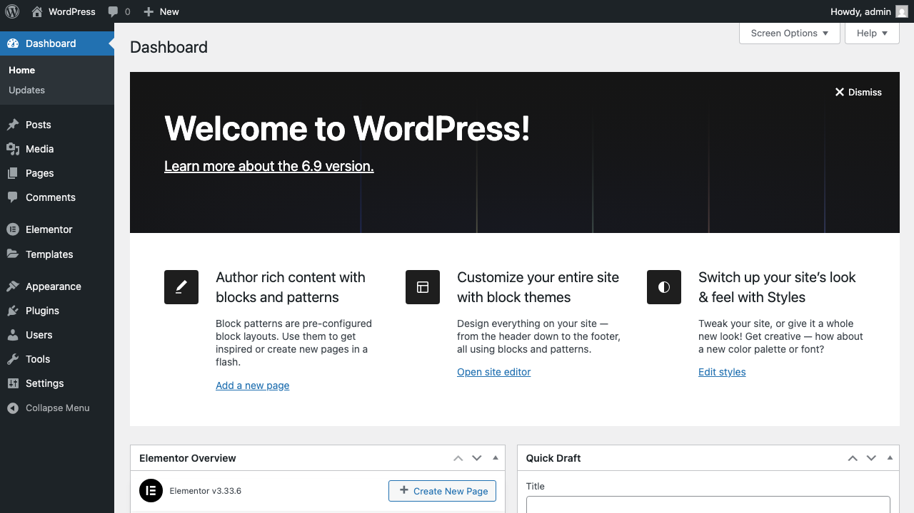
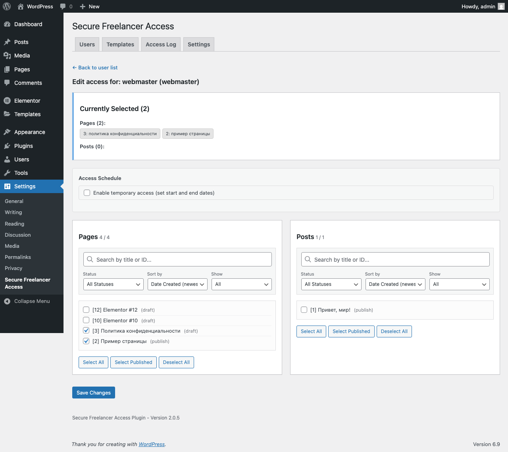
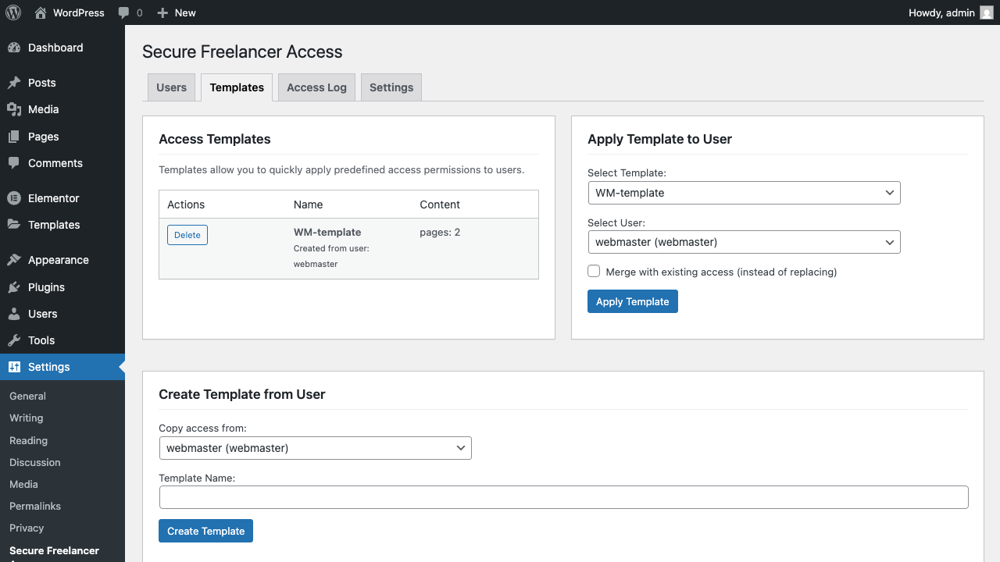
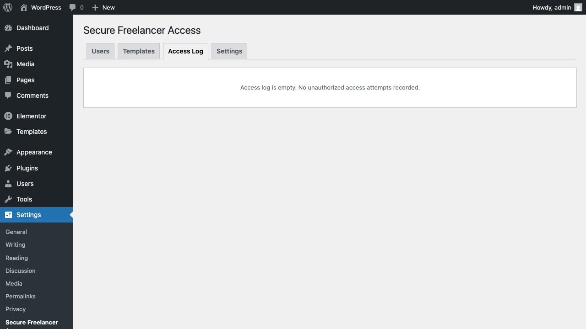

# Secure Freelancer Access

A WordPress plugin for granular content access control. Restrict Editors to specific pages and posts only.


## The Problem

By default, WordPress users with the Editor role can see ALL pages and posts. This creates issues when you need to give a freelancer or external specialist access to only specific content.

## The Solution

**Secure Freelancer Access** allows administrators to precisely configure which pages and posts each editor can see:

- Only allowed items appear in admin lists
- Direct URL access to forbidden pages is blocked (403 Forbidden)
- All access attempts are logged for security audit

## Screenshots

| Admin Dashboard | User Access Settings |
|-----------------|---------------------|
|  |  |

| Access Templates | Access Log |
|------------------|------------|
|  |  |

## Features

### Core Features
- Restrict access to specific Pages and Posts
- Custom Post Types support
- Direct URL blocking (403 Forbidden)
- Access attempt logging
- Secure (nonce validation, input sanitization, output escaping)

### Advanced Features (v2.0+)
- **WooCommerce Integration** - Products, Orders, Coupons
- **Elementor Integration** - Templates, Theme Builder
- **Media Library Filtering** - Restrict media access
- **Access Templates** - Save and apply permission sets
- **Copy Permissions** - Clone access between users
- **Temporary Access** - Set start/end dates
- **Dashboard Widgets** - Quick access overview
- **Export/Import** - JSON backup of settings
- **WP-CLI Commands** - Command-line management
- **REST API Protection** - Secure API endpoints
- **Multiple Role Support** - Configure any role

## Installation

### From WordPress Admin (Recommended)

1. Download the latest release ZIP from [Releases](https://github.com/air900/wp-secure-freelancer-access/releases)
2. Go to `Plugins → Add New → Upload Plugin`
3. Upload the ZIP file and click Install
4. Activate the plugin

### Manual Installation

1. Download and extract the plugin
2. Upload to `/wp-content/plugins/secure-freelancer-access/`
3. Activate in WordPress admin

### Via WP-CLI

```bash
wp plugin install https://github.com/air900/wp-secure-freelancer-access/releases/latest/download/secure-freelancer-access.zip --activate
```

## Quick Start

1. Go to `Settings → Secure Freelancer Access`
2. Select a user from the list
3. Click "Edit Access"
4. Check the pages and posts to allow
5. Save changes

The editor will now only see the allowed content!

## Requirements

- WordPress 5.8+
- PHP 7.4+
- MySQL 5.6+

## Documentation

### Data Storage

Access permissions are stored in `wp_usermeta`:
- `rpa_allowed_pages` - Array of allowed page IDs
- `rpa_allowed_posts` - Array of allowed post IDs

Access logs are stored in `wp_options` as `rpa_access_logs`.

### WP-CLI Commands

```bash
# List users with restrictions
wp sfa list

# Show user access
wp sfa show <user_id>

# Grant access to post
wp sfa grant <user_id> <post_id>

# Revoke access
wp sfa revoke <user_id> <post_id>

# Clear access log
wp sfa clear-log
```

### Hooks & Filters

```php
// Modify allowed post types
add_filter('rpa_allowed_post_types', function($types) {
    $types[] = 'my_custom_post_type';
    return $types;
});

// Modify restricted roles
add_filter('rpa_restricted_roles', function($roles) {
    $roles[] = 'author';
    return $roles;
});
```

## FAQ

**Does this affect administrators?**
No. Administrators with `manage_options` capability see all content without restrictions.

**Can I restrict Custom Post Types?**
Yes! Enable them in Settings → Content Types tab.

**What happens when an editor tries to access a forbidden page?**
They see "Access Denied" (HTTP 403) and the attempt is logged.

**Does this work with page builders?**
Yes! Tested with Elementor, and compatible with other page builders.

## Changelog

See [readme.txt](readme.txt) for full changelog.

### 2.0.5
- Moved Actions column to the beginning of tables

### 2.0.4
- Updated admin UI labels

### 2.0.2
- WooCommerce & Elementor integration
- Access Templates
- Export/Import
- WP-CLI commands
- Temporary access scheduling

### 1.0.0
- Initial release

## Contributing

Bug reports and pull requests are welcome!

1. Fork the repository
2. Create your feature branch (`git checkout -b feature/amazing-feature`)
3. Commit your changes (`git commit -m 'Add amazing feature'`)
4. Push to the branch (`git push origin feature/amazing-feature`)
5. Open a Pull Request

## License

GPLv2 or later. See [LICENSE](https://www.gnu.org/licenses/gpl-2.0.html).

## Author

**air900** - [GitHub](https://github.com/air900)

---

If you find this plugin useful, please consider giving it a star on GitHub!
